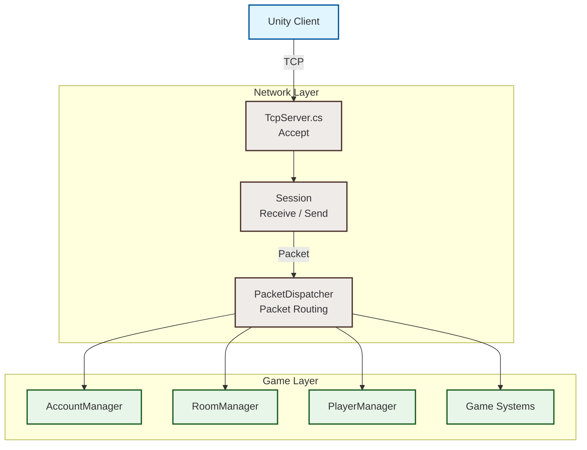
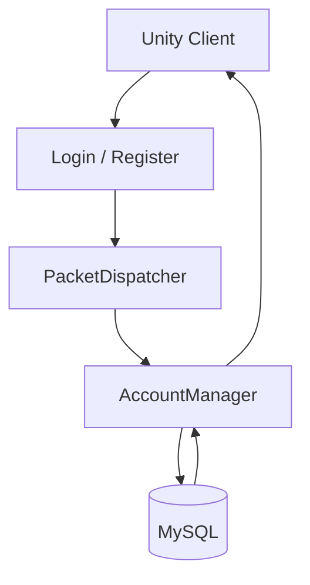
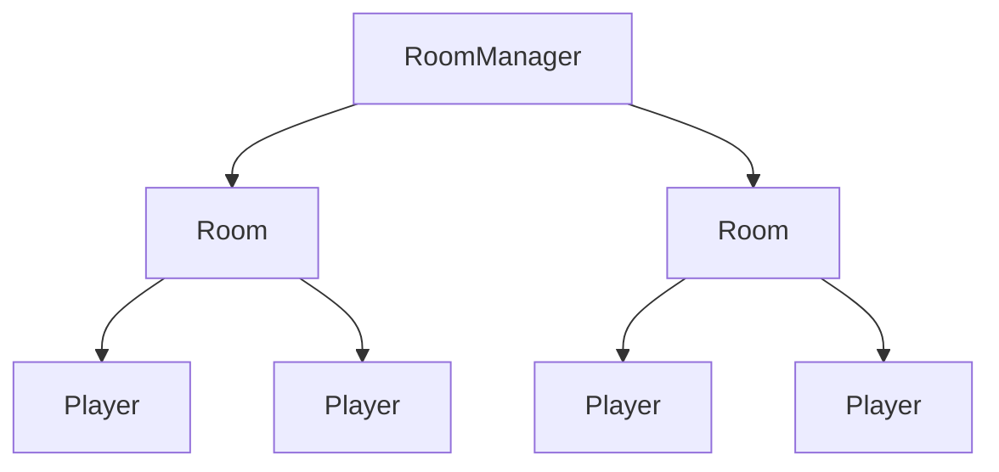
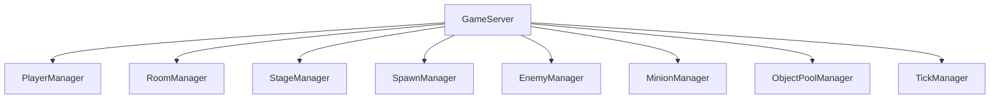
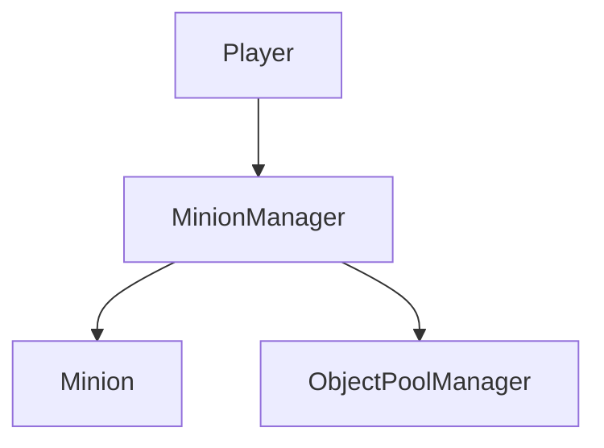
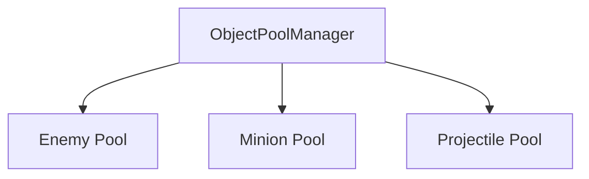

# CTD_Server

## 소개

본 저장소는 `Chess Tower Defense`의 멀티플레이 기능을 위해 별도로 개발한 게임 서버 프로젝트입니다.

본 서버는 대규모 MMORPG를 목표로 한 서버가 아닌, **Chess Tower Defense의 협동 멀티플레이를 지원하기 위한 게임 서버**로 개발되었습니다.

서버의 네트워크 구조, 패킷 설계, 게임 상태 관리, 데이터베이스 연동 및 클라이언트 동기화 구조를 문서화하는 것을 목적으로 합니다.

<details>
<summary><b>1. 📝 프로젝트 소개</b></summary>

### 📅 개발 기간

* 2026.07 ~ (지속 개발 및 고도화 중)

### 🎮 프로젝트

* **Chess Tower Defense Server**
* Chess Tower Defense의 멀티플레이를 지원하기 위한 C++ 기반 게임 서버

### 👤 개발 인원 및 역할

* **1인 개발 (Solo Project)**

  * C++ 기반 게임 서버 아키텍처 설계 및 구현
  * TCP 기반 Client / Server 네트워크 통신 구현
  * Packet Header 및 Serialization / Deserialization 구조 설계
  * Session 및 Packet Dispatcher 구현
  * Login / Register 및 MySQL 연동
  * Player / Room / Enemy / Minion 등 게임 서버 시스템 구현
  * 서버 권위(Server Authoritative) 기반 전투 상태 동기화
  * Object Pool 기반 게임 객체 관리
  * Tick 기반 게임 서버 업데이트 구조 구현
  * Mutex / Atomic을 활용한 공유 데이터 동기화

### 🎯 개발 목표

Unity 클라이언트에서 동작하던 Chess Tower Defense를 네트워크 환경으로 확장하기 위해

**Client → Server → Client**

구조의 게임 서버를 직접 설계하고 구현했습니다.

특히 클라이언트와 서버가 각각 전투 결과를 계산하면서 발생했던 Enemy HP 및 사망 상태 불일치 문제를 해결하기 위해 **서버를 게임 상태의 기준으로 사용하는 Server Authoritative 구조**를 적용했습니다.

</details>

<details>
<summary><b>2. 🎮 서버의 역할 및 게임 구조</b></summary>

### ♟️ Chess Tower Defense Multiplayer

Chess Tower Defense는 체스 기물을 기반으로 한 Tower Defense 게임입니다.

멀티플레이 환경에서는 두 명의 플레이어가 하나의 Room에 입장하여 동일한 게임 상태를 공유합니다.

서버는 다음과 같은 게임 상태를 관리합니다.

* Player 상태
* Room 상태
* Stage 상태
* Wave 상태
* Enemy 상태
* Minion 상태
* Projectile 상태
* Gold 및 게임 재화
* 공격 이벤트
* Enemy HP 및 사망 상태

### 👥 기본 멀티플레이 흐름

```text
Player 1
    │
    │
    ▼
┌─────────────────────┐
│        Room         │
│                     │
│  Player 1           │
│  Player 2           │
│                     │
│  Game State         │
│  Enemy / Minion     │
└──────────┬──────────┘
           │
           ▼
      Game Server
           │
      ┌────┴────┐
      ▼         ▼
 Client 1    Client 2
```

현재 구조에서는 **2명의 플레이어가 준비되면 게임을 시작하는 협동 플레이 방식**을 기준으로 서버를 구성했습니다.

### 🎯 Server Authoritative

게임의 중요한 상태를 클라이언트가 각각 계산하는 방식이 아닌 서버가 기준을 가지고 관리합니다.

```text
             Client 1
                │
                │
             Client 2
                │
                ▼
        ┌───────────────┐
        │ Game Server   │
        │               │
        │ Enemy HP      │
        │ Death State   │
        │ Game State    │
        └───────┬───────┘
                │
                ▼
       Broadcast Result
                │
          ┌─────┴─────┐
          ▼           ▼
       Client 1     Client 2
```

이를 통해 각 클라이언트의 처리 시점 차이로 인해 발생할 수 있는 게임 상태 불일치를 줄이고 서버의 게임 상태를 기준으로 클라이언트를 동기화합니다.

</details>

<details>
<summary><b>3. 🛠️ 기술 스택 (Tech Stack)</b></summary>

### Language

* **C++20**

### Network

* **Standalone Asio 1.38.2**
* TCP Socket
* Asynchronous Receive / Send
* Packet Header 기반 Packet Framing

### Database

* **MySQL**

### Build

* **CMake**
* **vcpkg**
* **MSVC**

### Platform

* Windows
* Linux

### Client

* **Unity 2022.3.62f3**
* C#

### Architecture

* Session / Packet Dispatcher
* Manager 기반 게임 시스템
* Room 기반 Multiplayer
* Server Authoritative
* Object Pooling
* Tick 기반 Game Loop
* Mutex / Atomic 기반 동기화

</details>

<details>
<summary><b>4. 📂 프로젝트 디렉터리 구조 (Directory Tree)</b></summary>

```text
CTD_Server/
├── CMakeLists.txt
│
├── External/
│   └── asio/
│
├── Include/
│   ├── Core/
│   │   ├── Logger.h
│   │   └── ...
│   │
│   ├── Network/
│   │   ├── TcpServer.h
│   │   ├── Session.h
│   │   ├── PacketDispatcher.h
│   │   ├── PacketReader.h
│   │   └── PacketWriter.h
│   │
│   ├── Game/
│   │   ├── GameServer.h
│   │   ├── Room.h
│   │   ├── Player.h
│   │   ├── Enemy.h
│   │   ├── Minion.h
│   │   ├── Wave.h
│   │   └── Projectile.h
│   │
│   ├── Manager/
│   │   ├── PlayerManager.h
│   │   ├── AccountManager.h
│   │   ├── RoomManager.h
│   │   ├── EnemyManager.h
│   │   ├── MinionManager.h
│   │   ├── SpawnManager.h
│   │   ├── ObjectPoolManager.h
│   │   ├── StageManager.h
│   │   └── TickManager.h
│   │
│   └── Database/
│       └── Database.h
│
├── Source/
│   ├── Core/
│   ├── Network/
│   ├── Game/
│   ├── Manager/
│   ├── Database/
│   └── main.cpp
│
└── README.md
```

</details>

<details>
<summary><b>5. 🏗️ 주요 아키텍처 및 시스템</b></summary>

<details>
<summary><b>🌐 Network System (TCP / Session / Dispatcher)</b></summary>

## 🌐 Network System

서버의 네트워크 계층은 `TcpServer`, `Session`, `PacketDispatcher`로 역할을 분리했습니다.

네트워크 연결을 담당하는 코드와 실제 게임 로직을 분리하여 새로운 Packet을 추가하거나 게임 시스템을 변경하더라도 네트워크 계층의 수정 범위를 최소화하도록 설계했습니다.

### 📐 구조도



### 1. TcpServer

`TcpServer`는 클라이언트의 TCP 연결을 받아 새로운 `Session`을 생성합니다.

```text
TcpServer
    │
    └── Accept
          │
          ▼
       Session
          │
          ├── Receive
          └── Send
```

각 클라이언트 연결은 독립적인 `Session`을 통해 관리됩니다.

### 2. Session

`Session`은 개별 클라이언트와의 통신을 담당합니다.

주요 역할:

* TCP 연결 관리
* 비동기 Receive
* 비동기 Send
* 수신 Buffer 관리
* Packet Header 분석
* 완성된 Packet 추출
* 연결 종료 처리

`Session`에서는 패킷을 직접 처리하지 않고 `PacketDispatcher`로 전달합니다.

### 3. PacketDispatcher

`PacketDispatcher`는 Packet Type을 기준으로 실제 처리 로직을 연결합니다.

```text
Session
   │
   ▼
Packet Header
   │
   ▼
PacketDispatcher
   │
   ├── Login
   ├── Register
   ├── JoinRoom
   ├── StageStart
   ├── LoadedScene
   ├── Spawn
   ├── Relocate
   ├── Sell
   ├── Upgrade
   ├── UseGold
   └── AttackNotify
```

### 🌟 설계 이점

1. **네트워크 / 게임 로직 분리**
2. **Packet 추가에 대한 확장성**
3. **Session 코드의 책임 최소화**
4. **게임 시스템 변경 시 네트워크 코드 영향 최소화**

</details>

<details>
<summary><b>📦 Packet System (Serialization / Deserialization)</b></summary>

## 📦 Packet System

TCP는 메시지 단위가 아닌 Byte Stream을 전달하기 때문에 패킷의 시작과 끝을 명확하게 구분하기 위한 Packet Header를 사용합니다.

### 📐 Packet 구조

```text
┌──────────────┬──────────────┐
│ Packet Size  │ Packet Type  │
│   uint16     │    enum      │
└──────────────┴──────────────┘
              Payload
```

### Packet Header

```cpp
struct PacketHeader
{
    uint16_t size;
    PacketType type;
};
```

수신된 데이터는 Buffer에 누적한 후 Header의 Size를 기준으로 하나의 완성된 Packet을 추출합니다.

### PacketWriter / PacketReader

Packet 데이터를 직접 메모리 구조에 의존하여 처리하지 않고 `PacketWriter`와 `PacketReader`를 사용하여 필요한 데이터를 순차적으로 읽고 쓸 수 있도록 구성했습니다.

```text
PacketWriter
    │
    ├── int
    ├── uint32
    ├── float
    ├── bool
    └── string
```

```text
PacketReader
    │
    ├── int
    ├── uint32
    ├── float
    ├── bool
    └── string
```

가변 길이 데이터를 포함하는 Packet은 고정된 구조체 크기에 의존하지 않고 데이터의 순서를 기준으로 직렬화 / 역직렬화합니다.

### 📢 AttackNotify

공격 이벤트는 하나의 Packet에 여러 공격 정보를 포함할 수 있도록 구성했습니다.

```text
AttackNotify
├── Attack Count
│
├── Attack Event
│   ├── Attack Type
│   ├── Is Projectile
│   ├── Minion Instance ID
│   ├── Damage
│   ├── Target Count
│   └── Target Instance IDs
│
├── Attack Event
│   └── ...
│
└── ...
```

이를 통해 짧은 시간에 다수의 공격이 발생하는 Tower Defense 환경에서 공격 이벤트를 하나의 Packet으로 묶어 전송할 수 있습니다.

</details>

<details>
<summary><b>👤 Account System (Login / Register / MySQL)</b></summary>

## 👤 Account System

계정 시스템은 Unity Client와 Server 간 Login / Register Packet을 주고받는 방식으로 구현했습니다.

### 📐 구조도



### Register

```text
Unity Client
      │
      │ RegisterRequest
      ▼
PacketDispatcher
      │
      ▼
AccountManager
      │
      ▼
MySQL
      │
      ▼
RegisterResponse
      │
      ▼
Unity Client
```

### Login

```text
Unity Client
      │
      │ LoginRequest
      ▼
PacketDispatcher
      │
      ▼
AccountManager
      │
      ├── Account Validation
      ├── Duplicate Login Check
      └── Access Token
             │
             ▼
       LoginResponse
             │
             ▼
       Unity Client
```

### Login Response

로그인 성공 시 서버는 클라이언트가 이후 게임 세션에서 사용할 수 있는 사용자 정보를 전달합니다.

```text
LoginResponse
├── UUID
├── Player ID
├── Access Token
└── Error Code
```

</details>

<details>
<summary><b>🏠 Room System (Multiplayer)</b></summary>

## 🏠 Room System

멀티플레이 게임의 한 세션을 `Room` 단위로 관리합니다.

`RoomManager`는 생성된 Room을 관리하고, Room 내부에서는 플레이어와 게임 상태를 관리합니다.

### 📐 구조도



### Room 내부 상태

```text
Room
├── Player
├── Player
├── Game State
├── Enemy Manager
├── Minion Manager
├── Wave State
└── Command Queue
```

플레이어의 요청이 Room의 게임 상태에 영향을 주는 경우 Room 내부의 처리 흐름을 통해 게임 상태가 변경되도록 구성했습니다.

### Game Start

현재 게임 시작 조건은 두 명의 플레이어가 준비된 상태를 기준으로 구성했습니다.

```text
Player 1 ── Ready
              │
Player 2 ── Ready
              │
              ▼
        Room Start
              │
              ▼
        Stage Start
```

</details>

<details>
<summary><b>🎮 Game Server Architecture</b></summary>

## 🎮 Game Server Architecture

게임 서버는 게임 객체의 종류와 책임에 따라 여러 Manager로 분리했습니다.

### 📐 구조도



### 주요 Manager 역할

#### `PlayerManager`

현재 접속 중인 Player를 관리합니다.

* Player 생성 및 등록
* Player 검색
* Player 제거
* Player 상태 관리

#### `RoomManager`

게임 Room을 관리합니다.

* Room 생성
* Room 검색
* Room 제거
* Player의 Room 입장 / 퇴장

#### `StageManager`

Stage 진행 상태를 관리합니다.

* Stage 초기화
* Wave 상태 관리
* 게임 진행 상태 관리

#### `SpawnManager`

Enemy Spawn을 담당합니다.

* Spawn 시점 관리
* Enemy 생성 요청
* Wave 기반 Spawn 처리

#### `EnemyManager`

Room에서 활성화된 Enemy를 관리합니다.

* Enemy 생성
* Enemy 검색
* Enemy 제거
* Enemy 상태 관리

#### `MinionManager`

Player가 사용하는 Minion을 관리합니다.

* Minion 생성
* Minion 검색
* Minion 제거
* Minion 공격 처리

#### `ObjectPoolManager`

반복적으로 생성 / 제거되는 게임 객체를 Pool 기반으로 관리합니다.

#### `TickManager`

주기적으로 실행되어야 하는 서버 작업을 관리합니다.

</details>

<details>
<summary><b>👾 Enemy System</b></summary>

## 👾 Enemy System

Enemy는 서버에서 생성되고 고유한 `instanceId`를 부여받습니다.

클라이언트에서는 해당 ID를 기준으로 서버가 생성한 Enemy를 식별할 수 있습니다.

### Enemy 구조

```text
Enemy
├── instanceId
├── HP
├── Position
├── State
└── ...
```

### Enemy 관리

Enemy의 생성과 활성 상태는 `EnemyManager`가 관리합니다.

```text
SpawnManager
      │
      ▼
EnemyManager
      │
      ▼
ObjectPoolManager
      │
      ▼
Enemy
      │
      ▼
instanceId
```

### Enemy 삭제

Enemy가 사망하면 Manager에서 해당 Enemy를 제거하고 Object Pool로 반환합니다.

```text
Enemy Death
     │
     ▼
EnemyManager
     │
     ├── Active List에서 제거
     │
     ▼
ObjectPoolManager
     │
     ▼
Pool Return
```

</details>

<details>
<summary><b>♟️ Minion System</b></summary>

## ♟️ Minion System

Minion은 Player가 사용하는 체스 기물이며 서버에서는 각각 고유한 `instanceId`를 기준으로 관리합니다.

### Minion 구조

```text
Minion
├── instanceId
├── Owner Player
├── Minion Type
├── Position
├── Stat
└── Attack State
```

### Minion 관리



Minion은 서버에서 실제 게임 상태를 관리하며 공격 이벤트가 발생하면 `AttackEvent`를 생성합니다.

</details>

<details>
<summary><b>⚔️ Server Authoritative Attack System</b></summary>

## ⚔️ Server Authoritative Attack System

서버 개발 과정에서 가장 중요한 문제 중 하나는 Client와 Server가 각각 공격 및 Enemy HP를 계산하면서 발생하는 **전투 상태 불일치**였습니다.

### 기존 문제

```text
Client
  │
  ├── Attack 계산
  └── Enemy HP 감소

Server
  │
  ├── Attack 계산
  └── Enemy HP 감소

       ↓

처리 시점 차이

       ↓

HP / Death State 불일치
```

특히 네트워크 지연과 Client / Server의 실행 타이밍 차이로 인해 동일한 Enemy에 대한 HP 상태가 서로 다르게 유지될 수 있었습니다.

### 변경된 구조

```text
Unity Client
      │
      │ Attack Event
      ▼
Game Server
      │
      ├── Attack 처리
      ├── Damage 계산
      ├── Enemy HP 변경
      ├── Death 판정
      │
      ▼
Attack Event Queue
      │
      ▼
Broadcast
      │
 ┌────┴────┐
 ▼         ▼
Client 1  Client 2
```

서버가 Enemy의 HP 및 Death State를 결정하고 클라이언트는 서버의 결과를 반영하도록 구조를 변경했습니다.

### 🌟 적용 효과

* Client / Server 간 Enemy HP 불일치 감소
* Death State의 기준 통일
* Multiplayer 환경에서 게임 상태의 기준점 확보
* 전투 결과 동기화 구조 단순화

</details>

<details>
<summary><b>📢 Attack Queue & Batch Processing</b></summary>

## 📢 Attack Queue & Batch Processing

Tower Defense에서는 짧은 시간에 여러 Minion이 동시에 공격할 수 있습니다.

각 공격마다 별도의 Packet을 전송할 경우 불필요하게 많은 네트워크 메시지가 발생할 수 있기 때문에 공격 이벤트를 Queue에 저장한 후 일정 주기로 Batch 처리하도록 구성했습니다.

### AttackEvent

```cpp
struct AttackEvent
{
    AttackType attackType;
    bool isProjectile;

    uint32_t minionInstanceId;
    std::vector<uint32_t> targets;

    int damage;
};
```

### 처리 흐름

```text
Minion Attack
      │
      ▼
AttackEvent 생성
      │
      ▼
m_attackQueue
      │
      │ 일정 주기
      ▼
BroadcastAttack()
      │
      ▼
AttackNotify
```

### Packet 구조

```text
AttackNotify
│
├── Attack Count
│
├── Attack Event
│   ├── Attack Type
│   ├── Is Projectile
│   ├── Minion Instance ID
│   ├── Damage
│   ├── Target Count
│   └── Target IDs
│
└── ...
```

공격 이벤트를 하나의 Packet으로 묶어 전송함으로써 다수의 공격이 동시에 발생하는 상황에서도 네트워크 전송 구조를 단순화했습니다.

</details>

<details>
<summary><b>⏱️ Tick System</b></summary>

## ⏱️ Tick System

게임 서버에서 일정 주기로 실행되어야 하는 게임 로직을 관리하기 위해 `TickManager`를 구현했습니다.

### Game Loop

```text
GameServer::Run()
      │
      ▼
ioContext.poll()
      │
      ▼
TickManager.Update()
      │
      ├── Room Update
      ├── Stage Update
      ├── Enemy Update
      ├── Spawn Update
      └── Game Logic
      │
      ▼
Sleep
      │
      └── Repeat
```

`GameServer`의 실행 루프에서 네트워크 이벤트를 처리하고 게임 Tick을 업데이트하는 구조입니다.

### Tick 등록

각 시스템에서 일정 주기로 실행해야 하는 작업을 `TickManager`에 등록하여 중앙에서 관리할 수 있도록 구성했습니다.

</details>

<details>
<summary><b>♻️ Object Pooling System</b></summary>

## ♻️ Object Pooling System

Enemy, Minion, Projectile과 같이 생성과 제거가 반복되는 게임 객체를 효율적으로 관리하기 위해 서버에서도 Object Pool 구조를 적용했습니다.

### 📐 구조



### Instance ID 기반 관리

Pool에서 활성화된 객체는 고유한 `instanceId`를 기준으로 관리합니다.

```text
ObjectPoolManager
       │
       ▼
unordered_map
       │
       ├── instanceId → Enemy
       ├── instanceId → Minion
       └── instanceId → Projectile
```

게임 시스템에서는 메모리 주소가 아닌 `instanceId`를 사용하여 객체를 식별합니다.

### Manager와 Pool의 역할 분리

```text
ObjectPoolManager
        │
        │ 객체 생성 / 반환
        ▼
     Pool Object
        │
        ▼
EnemyManager
        │
        │ 활성 객체 관리
        ▼
      vector
```

Pool은 객체의 생명주기를 관리하고, 각 Manager는 현재 게임에서 활성화된 객체를 관리하는 방식으로 역할을 분리했습니다.

### 🌟 적용 효과

1. 반복적인 동적 할당 / 해제 감소
2. 게임 객체의 생명주기 관리 단순화
3. Instance ID 기반 객체 식별
4. Manager와 Pool의 책임 분리

</details>

<details>
<summary><b>🧵 Thread Safety & Synchronization</b></summary>

## 🧵 Thread Safety & Synchronization

네트워크 서버에서 여러 실행 흐름이 공유 데이터를 접근할 수 있는 상황을 고려하여 Mutex와 Atomic을 사용한 동기화 처리를 적용했습니다.

### 주요 동기화 도구

* `std::mutex`
* `std::recursive_mutex`
* `std::atomic`
* `std::lock_guard`

### Player Gold

동시에 Gold를 사용하는 요청이 발생할 수 있는 상황을 고려하여 Gold 변경에 Atomic 연산을 적용했습니다.

```cpp
bool Player::TryUseGold(int amount)
{
    int current = m_gold.load();

    while (current >= amount)
    {
        if (m_gold.compare_exchange_weak(
                current,
                current - amount))
        {
            return true;
        }
    }

    return false;
}
```

### Room 동기화

Room 내부의 공유 상태는 Mutex를 통해 접근을 보호합니다.

```text
Thread
  │
  ▼
Room
  │
  ├── Player
  ├── Game State
  ├── Enemy
  └── Command Queue
       │
       ▼
```
